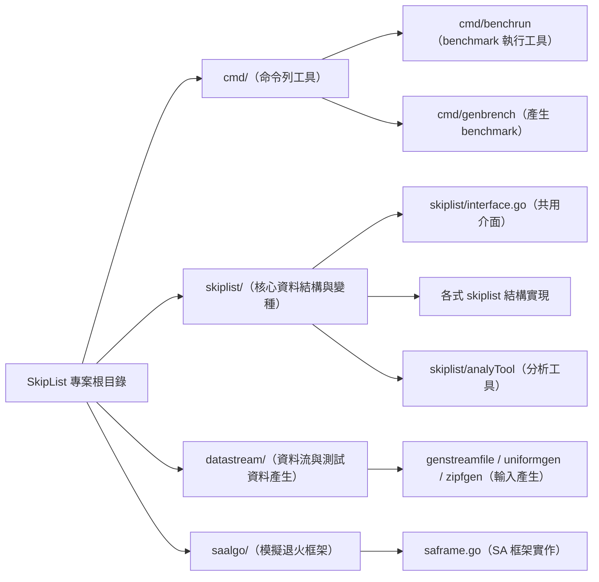

# SkipList (Go) 專案

本專案實作多種跳躍列表（Skip List）與相關分析/基準測試工具，並提供資料流（bench 文件）產生器與比較/分析程式。

**Quick Overview**

- **專案類型**: Go 語言實作的資料結構與基準工具
- **主要功能**: 多種跳躍列表實作（basic, splay, la, rebuild, gravity, falldown）、bench 檔案產生器、bench 執行與匯總分析
- **目標**: 比較不同跳躍列表在不同存取分布（例如 Zipf）下的效能

**建置 / 測試**

- **安裝相依**: 在專案根目錄執行 `go mod tidy`
- **建置所有套件**: `go build ./...`
- **執行測試**: `go test ./...`

**快速範例 — 產生 benchmark 檔案**

- 產生一個基於 Zipf 分布的 bench 檔案（PowerShell 範例）:

```
go run ./cmd/genbrench -n 10000 -k 100000 -a 1.07 -out bench_n10k_k100k.bin
```

- `cmd/genbrench` 支援的重要 flag:
  - `-n` : key 數量（支援科學記號，例如 `1e5`）
  - `-k` : 操作數
  - `-a` / `-b` : Zipf 參數 (a, b)，若 `a==0` 則使用均勻分布
  - `-out` : 輸出檔名前綴
  - `-path` : 輸出目錄

**快速範例 — 執行 benchmark 與匯總**

- 單一檔案詳盡執行:

```
go run ./cmd/benchrun -file bench_n10k_k100k.bin -impl basic,la,splay -runs 5
```

- 多檔案批次執行（指定目錄）:

```
go run ./cmd/benchrun -dir ./bench_files -impl all -runs 3
```

- `cmd/benchrun` 支援的重點 flag:
  - `-file` / `-dir` : 指定單一 bench 檔或目錄（會測試所有 `.bin`）
  - `-out` : 用於產生的模式（若使用產生模式）
  - `-impl` : 要測試的實作（`basic,splay,la,rebuild,gravity,falldown` 或 `all`）
  - `-runs` : 每個組合重複次數
  - `-splay.p`, `-rebuild.p` : 各實作的調校參數
  - `-phase1Ratio`, `-deleteRatio` : 用於產生檔案時的策略參數

## **bench 檔案格式（簡要）**

- 檔頭 Magic: `SLBENCH1` (8 bytes)
- Version: uint16 (目前為 1)
- Distribution table: uint32 DistCount，接著每筆為 `int64 Key` + `float64 Weight`
- Operations: uint64 OpCount，接著每筆為 `uint8 OpType` + `int64 Key`

此格式由 `datastream` 包提供的 `WriteBenchFileFromZipfV2` / `WriteBenchFileFromZipf` / `writeBenchFileFromUniform` 產生，並由 `datastream.ReadBenchFile` 讀取。

## **專案結構與主要套件說明**

- `cmd/` : 一些可執行工具

  - `genbrench` : 產生 bench 檔案（Zipf or uniform）
  - `benchrun` : 執行 benchmark、顯示單檔詳細結果或多檔匯總
  - `compare` :（比較工具，請參考 `cmd/compare/main.go`）
- `datastream/` : bench 檔案格式、產生器與 I/O（`genstreamfile.go`, `zipfgen.go`, `uniformgen.go`）
- `skiplist/` : 跳躍列表實作與分析工具

  - `basic/` : 基礎版本的 basic skip list 實作
  - `splay/` : [The Splay-List: A Distribution-Adaptive  Concurrent Skip-Listsplay-list](https://link.springer.com/article/10.1007/s00446-022-00441-x)
  - `la/` :  [Learning-Augmented Search Data Structures](https://arxiv.org/abs/2402.10457)（`PutWithNP` 支援預測頻率以調整高度）
  - `T-list` : [A Concurrent Skip List Balanced on Search](https://link.springer.com/chapter/10.1007/978-3-319-67952-5_11)
  - `rebuildsl/`, `gravity/`, `falldown/` 等：自提出的其他變體
  - `analyTool/` : 提供步驟分析、印表等輔助工具
- `saalgo/` : 模擬退火演算法框架（研究輔助用）

**範例工作流程**

1. 產生 bench 檔案:

```
go run ./cmd/genbrench -n 1e5 -k 1e6 -a 1.07 -b 1 --out benchfile
```

2. 執行 benchmark:

```
 go run .\cmd\benchrun\ --file benchfile.bin --run 5
```

3. 如需多檔案匯總，將檔案放在同一目錄後使用 `-dir`。
4. 或是每次都產生新檔案測試

```
go run .\cmd\benchrun\ -a 1.5 -b 1 -n 100000 -k 1000000 -out test.bin
```
